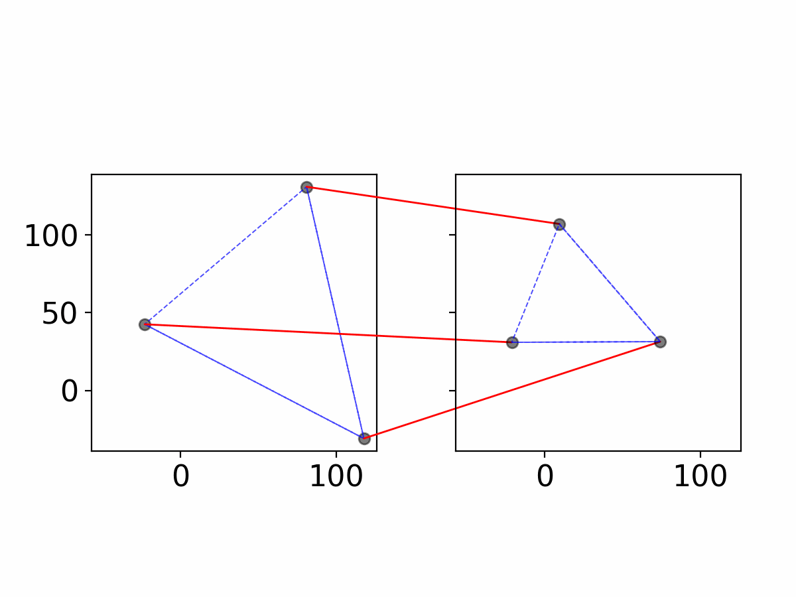

# `rts_align`

This python package produces an association graph to match 2-D point clouds that
may differ in rotation, translation, and scale. The core idea involves
properties of similar triangles:

A similar JAVA implementation is provided as part of https://github.com/CSAFE-ISU/shoecomp.
